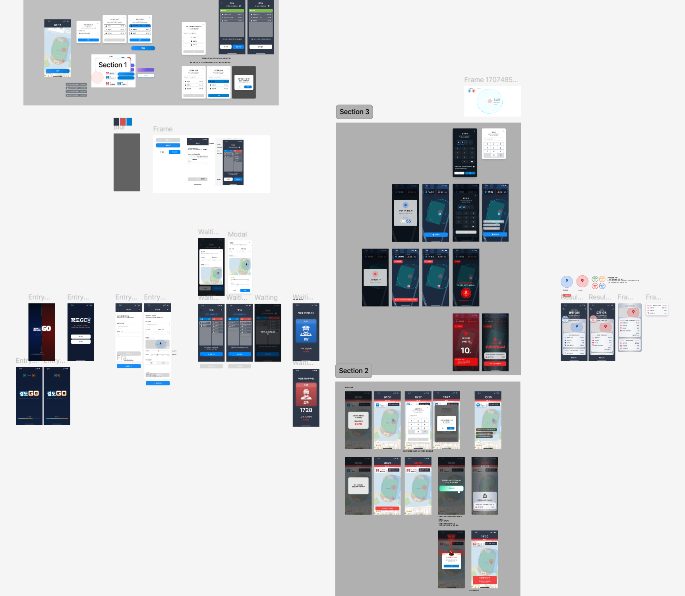

# Gyeong-do-GO (경도GO) 🚓🏃

> GPS 기반 실시간 멀티플레이 **'경찰과 도둑'** 모바일 게임

실제 위치(GPS)를 활용해 현실 공간에서 즐기는 술래잡기 게임입니다. 한 방에 모인 플레이어들이 **경찰(POLICE)** 과 **도둑(THIEF)** 으로 나뉘어, 경찰은 도둑을 추격해 검거하고 도둑은 정해진 시간 동안 살아남거나 잡힌 동료를 구출합니다. 모든 플레이어의 위치는 WebSocket을 통해 1초 단위로 실시간 동기화됩니다.

---

## 🎨 디자인

전체 화면 흐름은 Figma로 설계했습니다.



---

## 📑 목차

- [디자인](#-디자인)
- [주요 기능](#-주요-기능)
- [게임 진행 흐름](#-게임-진행-흐름)
- [기술 스택](#-기술-스택)
- [시스템 아키텍처](#-시스템-아키텍처)
- [프로젝트 구조](#-프로젝트-구조)
- [실행 방법](#-실행-방법)
- [주요 API / 메시지](#-주요-api--메시지)

---

## ✨ 주요 기능

- **실시간 위치 동기화** — 클라이언트가 1초마다 위치를 전송하고, 서버는 진행 중인 방의 위치 스냅샷을 모든 참가자에게 브로드캐스트합니다.
- **방 생성 / 참가** — 방 코드로 입장하며, 방장이 맵 중심 좌표·반경·제한 시간 등 게임 설정을 조정합니다.
- **역할 시스템** — 경찰 / 도둑으로 분리되며, 도둑에게는 검거에 사용되는 고유 **죄수 번호**가 부여됩니다.
- **검거(Catch)** — 경찰이 도둑의 죄수 번호를 입력하고, 두 플레이어 간 거리가 **5m 이내**일 때 검거가 성립합니다.
- **구출(Rescue)** — 도둑이 맵 중심의 **감옥 구역(prison radius)** 안에 들어가면 잡힌 동료들을 한 번에 구출할 수 있습니다.
- **구역 이탈 처리** — 맵 반경을 벗어나 10초가 지나면 게임에서 자동 제외됩니다.
- **승패 판정 & MVP** — 도둑 전원 검거 시 경찰 승리, 제한 시간 종료 시 도둑 승리. 검거 수 / 구출 수 / 이동 거리 기준으로 MVP를 선정합니다.

---

## 🎮 게임 진행 흐름

게임은 서버의 `TaskScheduler`가 단계별 타이머를 관리하며 다음 상태(`GameStatus`)를 순차적으로 전이시킵니다.

```
WAITING ──▶ STARTING ──▶ ROLE_CHECK ──▶ RUNAWAY ──▶ PLAYING ──▶ FINISHED
 대기실      시작 카운트     역할 확인       도주 시간     본 게임      게임 종료
            (5초)         (12초)        (방 설정)     (방 설정)
```

| 단계 | 설명 |
|------|------|
| **WAITING** | 대기실. 방장이 설정을 조정하고 전원 `Ready` 시 시작 가능 |
| **STARTING** | 시작 카운트다운, 도둑에게 죄수 번호 부여 |
| **ROLE_CHECK** | 각 플레이어가 자신의 역할 확인 |
| **RUNAWAY** | 도둑이 먼저 흩어지는 도주 시간 (경찰 검거 불가) |
| **PLAYING** | 본 게임. 검거·구출·이탈 판정 진행 |
| **FINISHED** | 승패 및 MVP 결과 브로드캐스트 |

---

## 🛠 기술 스택

### Backend
| 분류 | 기술 |
|------|------|
| Language / Runtime | Java 25 |
| Framework | Spring Boot 4.0.2 |
| 실시간 통신 | Spring WebSocket + STOMP |
| 영속성 | Spring Data JPA |
| Database | PostgreSQL + PostGIS (위치 데이터), H2 (로컬) |
| In-memory Store | Redis (실시간 위치 / 이동거리) |
| Build / Infra | Gradle, Docker, Docker Compose |

### Frontend
| 분류 | 기술 |
|------|------|
| Framework | React Native (Expo SDK 54), Expo Router |
| 실시간 통신 | @stomp/stompjs |
| 지도 / 위치 | react-native-maps, @mj-studio/react-native-naver-map, expo-location, geolib |
| 기타 | expo-haptics, react-native-reanimated |

---

## 🏗 시스템 아키텍처

```
┌────────────────────────────┐         REST (/api/rooms)         ┌──────────────────────────────┐
│   React Native (Expo) App   │ ─────── 방 생성/참가/설정 ──────▶ │                              │
│                            │                                    │     Spring Boot Server      │
│  - SocketContext (STOMP)   │ ◀══════ WebSocket / STOMP ═══════▶ │                              │
│  - useLocation / 지도 UI    │   /app/game/*  ↔  /topic/room/{id} │  Controller ─ Service ─ Repo │
└────────────────────────────┘            /queue/player/{id}      └───────────┬──────────────────┘
                                                                              │
                                                          ┌───────────────────┴───────────────────┐
                                                          ▼                                         ▼
                                                ┌──────────────────┐                    ┌────────────────────┐
                                                │  PostgreSQL +     │                    │       Redis        │
                                                │  PostGIS          │                    │  실시간 위치/거리   │
                                                │  (방·플레이어 영속) │                    │  (휘발성 상태)      │
                                                └──────────────────┘                    └────────────────────┘
```

**설계 포인트**

- **REST와 WebSocket 분리** — 방 생성/참가/설정 같은 라이프사이클 작업은 REST(`/api/rooms`)로, 위치 공유·검거·구출 같은 고빈도 실시간 이벤트는 STOMP 메시지로 처리합니다.
- **Redis vs PostgreSQL** — 초당 갱신되는 위치/누적 이동거리는 Redis에 저장해 DB 부하를 줄이고, 게임 종료 시 최종 이동거리만 PostgreSQL의 `Player`에 반영합니다.
- **타이머 기반 단계 전이** — `GameFlowService`가 `TaskScheduler`로 각 단계의 종료 시각을 예약해 다음 단계로 전이하며, 트랜잭션 적용을 위해 `@Lazy` self-injection 패턴을 사용합니다.
- **STOMP 인증 인터셉터** — `StompHandler`가 CONNECT 시점에 `roomId`/`playerId`를 검증하고 세션에 저장해, 이후 메시지에서 DB 재조회 없이 식별합니다.

---

## 📂 프로젝트 구조

```
Gyeong-do-GO/
├── backend/                       # Spring Boot 서버
│   └── src/main/java/com/project/gyeong_do_go/
│       ├── game/                  # 게임 핵심 도메인
│       │   ├── controller/        # GameController (STOMP @MessageMapping)
│       │   ├── service/           # 세션/흐름/액션 서비스
│       │   │   ├── GameSessionService   # 입장·퇴장
│       │   │   ├── GameFlowService      # 단계 전이·승패·MVP
│       │   │   └── GameActionService    # 위치 갱신·검거·구출
│       │   ├── component/         # Broadcaster / Reader / Validator
│       │   ├── scheduler/         # 위치 스냅샷 주기 전송
│       │   ├── domain/            # GameStatus, GameConstants 등
│       │   └── dto/               # request / response
│       ├── room/                  # 방 도메인 (REST: /api/rooms)
│       ├── player/                # 플레이어 도메인 (JPA + Redis)
│       └── global/                # 공통 설정·예외·소켓·유틸
│           ├── config/            # WebSocketConfig, StompHandler
│           ├── socket/            # 연결 이벤트 리스너
│           └── util/              # GeometryUtil (거리 계산)
│
├── frontend/                      # React Native (Expo)
│   ├── app/                       # expo-router 화면
│   │   ├── entry/                 # 메인/방 생성/참가
│   │   ├── room/[roomId]/         # 대기실
│   │   └── game/                  # 본 게임 / 역할 확인
│   └── src/
│       ├── api/                   # REST 클라이언트
│       ├── context/               # SocketContext (STOMP)
│       ├── hooks/                 # useLocation, 구독 훅 등
│       ├── components/            # 공통/게임/대기실 UI
│       └── constants/             # 색상·타이포그래피
│
└── docker-compose.yml             # backend + postgis + redis
```

---

## 🚀 실행 방법

### 사전 요구사항
- Docker / Docker Compose
- (프론트엔드) Node.js, Expo CLI, Android/iOS 실기기 또는 에뮬레이터

### 1. Backend + DB + Redis (Docker Compose)

```bash
docker compose up --build
```

- `backend` : `http://localhost:8080` (프로필 `prod`)
- `db` : PostgreSQL + PostGIS (`localhost:5432`)
- `redis` : `localhost:6379`

> 로컬에서 직접 실행하려면 `backend/` 에서 `./gradlew bootRun` (기본 프로필 `local`)

### 2. Frontend (Expo)

```bash
cd frontend
cp .env.example .env      # 서버 IP, 지도 API 키 등 환경변수 설정
npm install
npx expo start
```

`.env` 주요 항목:

| 변수 | 설명 |
|------|------|
| `EXPO_PUBLIC_SERVER_IP` / `EXPO_PUBLIC_LOCALHOST_IP` | 백엔드 호스트 |
| `EXPO_PUBLIC_USE_LOCALHOST` | localhost 사용 여부 (`true`/`false`) |
| `EXPO_PUBLIC_API_PORT` | 백엔드 포트 (기본 `8080`) |
| `EXPO_PUBLIC_GOOGLE_MAPS_API_KEY` | 지도 API 키 |

> GPS를 사용하므로 위치 권한이 필요하며, 시뮬레이터보다 **실기기** 테스트를 권장합니다.

---

## 📡 주요 API / 메시지

### REST (`/api/rooms`)
| Method | Endpoint | 설명 |
|--------|----------|------|
| `POST` | `/api/rooms` | 방 생성 |
| `POST` | `/api/rooms/join` | 방 코드로 참가 |
| `PUT` | `/api/rooms/{roomId}/settings` | 방 설정 변경 (방장) |
| `GET` | `/api/rooms/{roomId}` | 방 상세 조회 |
| `POST` | `/api/rooms/{roomId}/start` | 게임 시작 (방장) |
| `POST` | `/api/rooms/{roomId}/reset` | 대기실로 초기화 |

### WebSocket / STOMP (`/ws`)
**Client → Server** (`/app` prefix)

| Destination | 설명 |
|-------------|------|
| `/app/game/join` · `/app/game/leave` | 게임 입장 / 퇴장 |
| `/app/game/location` | 현재 위치 전송 |
| `/app/game/catch` | 도둑 검거 (죄수 번호) |
| `/app/game/rescue` | 동료 구출 |

**Server → Client**

| Destination | 설명 |
|-------------|------|
| `/topic/room/{roomId}` | 방 상태 변경, 위치 스냅샷, 검거/구출/종료 등 브로드캐스트 |
| `/queue/player/{playerId}` | 개인 메시지 (예: 죄수 번호 부여) |
